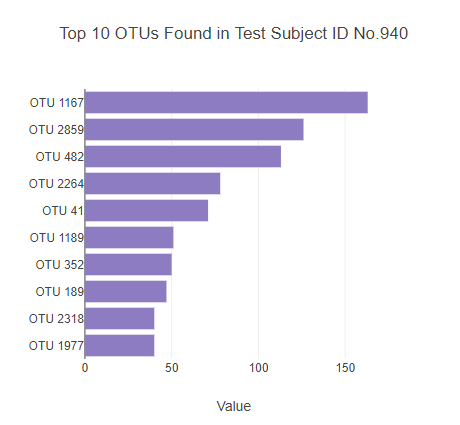

# Belly Button Biodiversity

Find the completed Belly Button Biodiversity website here: [Belly Button Biodiversity](https://sarakim-sy.github.io/plotly-challenge/)

In this repository, an interactive dashboard to explore the [Belly Button Biodiversity dataset](http://robdunnlab.com/projects/belly-button-biodiversity/), which catalogs the microbes that colonize human navels, was created.

The dataset reveals that a small handful of microbial species (also called operational taxonomic units, or OTUs, in the study) were present in more than 70% of people, while the rest were relatively rare.

## Step 1: Plotly

1. The D3 library to read in `samples.json` was used.

2. A horizontal bar chart with a dropdown menu to display the top 10 OTUs found in that individual was created.

* `sample_values` as the values for the bar chart.

* `otu_ids` as the labels for the bar chart.

* `otu_labels` as the hovertext for the chart.

  

3. A bubble chart that displays each sample was created.

* `otu_ids` for the x values.

* `sample_values` for the y values.

* `sample_values` for the marker size.

* `otu_ids` for the marker colors.

* `otu_labels` for the text values.

4. The sample metadata, an individual's demographic information, was displayed.

5. Each key-value pair from the metadata JSON object was displayed.

6. A Gauge Chart from <https://plot.ly/javascript/gauge-charts/> to plot the weekly washing frequency of the individual.

* Values ranging from 0 through 9.

* The chart will be updated whenever a new sample is selected.

7. All of the plots any time that a new sample is selected will be updated.

The created dashboard is shown below:

- - -

### About the Data

Hulcr, J. et al.(2012) _A Jungle in There: Bacteria in Belly Buttons are Highly Diverse, but Predictable_. Retrieved from: [http://robdunnlab.com/projects/belly-button-biodiversity/results-and-data/](http://robdunnlab.com/projects/belly-button-biodiversity/results-and-data/)

### Technologies
This project was created with:
* JavaScript
* HTML/CSS
* D3.js
* Plotly

